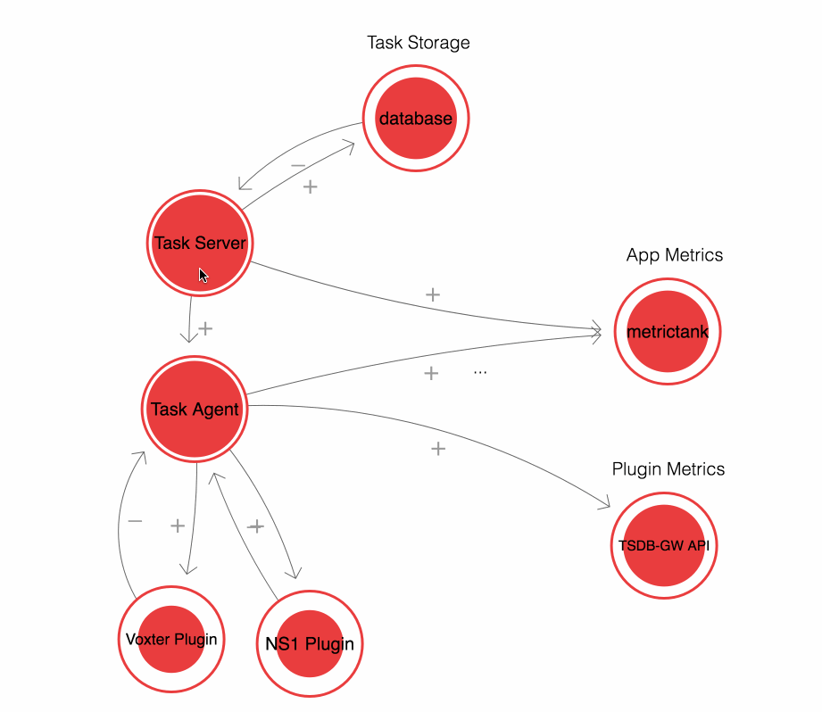

# Overall Architecture

[Diagram](https://bit.ly/2H1Oi5m)



## Task Server

The task server provides a REST API to manage plugins, requests, agents, and handles scheduling tasks to be executed by agents.

### Requests

Grafana Applications like NS1 connect to the task server to configure metric collection

### Tasks

Requests are turned into tasks that will be run by an agent.  Tasks have typical CRUD operations, and can also be enabled/disabled.

### Agents

Agents connect to the task server and receive tasks to process.


### Dependencies

Databases supported are sqlite3 and MySQL.

## Task Agent

Task agent executes a task on a regular interval specified by the task.
The task agent connects to a task server to receive tasks that need to be executed.

### Plugins

The task agent has builtin plugin support to process tasks.

#### NS1

The NS1 plugin leverages the NS1 API to get QPS stats for domains. These metrics are sent to the Grafana.com TSDB Gateway and are stored on a per-user basis using a Grafana API Key.

#### Voxter

Currently under development due to API changes.

# Deployment

The application can be run on an Ubuntu/Debian distribution, under docker, and also inside a Kubernetes cluster.

## Kubernetes

Example Kubernetes deployment are provided.

## Docker

A "docker-compose" example is provided that will stand up a complete instance of the application.

# Internal Metrics

## Task Agent Metrics
The following metrics are sent to metrictank, using the prefix:
```
raintank.app.stats.taskagent.$instance
```

|name|type|description|
|----|----|-----------|
runner.initialized|gauge|
runner.tasks.active.count|gauge|
runner.tasks.added.count|counter|
runner.tasks.updated.count|counter|
runner.tasks.removed.count|counter|

## Plugin Metrics
### NS1
|name|type|description|
|----|----|-----------|
collector.ns1.collect.attempts.count|counter|
collector.ns1.collect.success.count|counter|
collector.ns1.collect.failures.count|counter|
collector.ns1.client.queries.count|counter|
collector.ns1.client.authfailures.count|counter|

## Task Server metrics

The following metrics are sent to metrictank, using the prefix:
```
raintank.app.stats.taskserver.$instance
```
|name|type|description|
|----|----|-----------|
api.tasks_create|counter|
api.tasks_delete|counter|
api.agents_connected|gauge|
agents.connections.active|gauge|
agents.connections.failed|counter|
agents.connections.accepted|counter|
taskserver.running|gauge|
